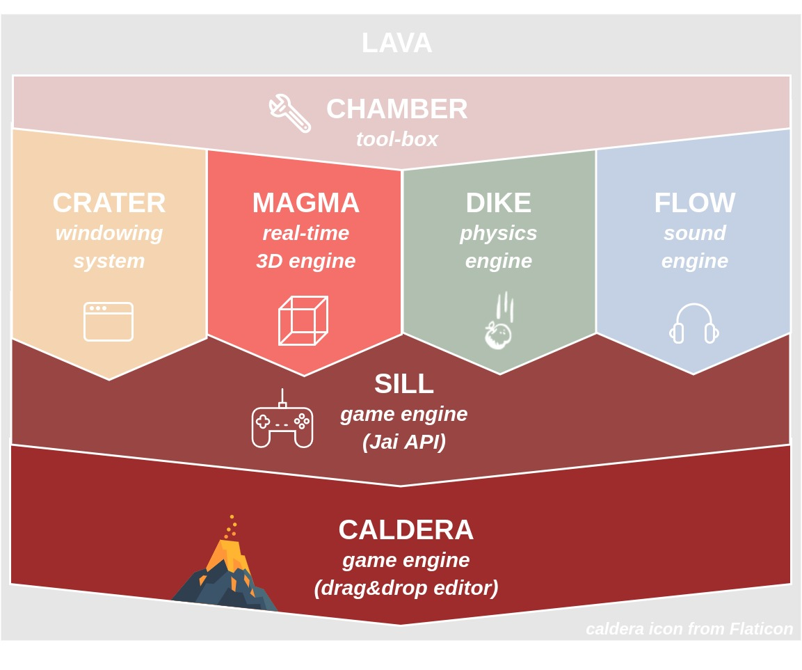

# lava

This project is a port of [lava](https://github.com/Breush/lava/) to Jai language. 
I'm not creating bindings to it, I'm rewritting it completely in Jai.

**Still a work in progress!** 
Focusing on linux support so far, so it's probably useless for other platforms right now.

## Project's composition

The **lava** project is in fact a bundle of multiple projects. The image below describes what's the **goal**.

The core principles of **lava** are:
- Provide cross-platform redistribuable modules.
- Keep in mind [essentials in designing API](https://caseymuratori.com/blog_0024).
- Be simple. Document using clever examples.

## Examples

| Example  | Description | Result |
| ---- | ---- | ---- |
| [**crater**-events](https://github.com/Breush/lava/tree/master/examples/crater-events)  | How to interact with `Crater.Window` by grabbing keyboard and mouse events. | `MousePointerMoved -> {592, 128, -2, -2}` |

## Current status

- [40%] **Crater** (windowing system)
    - Linux support OK using generated Xcb/Xkb bindings.
    - Windows support using DWM not started.
    - Missing fullscreen option.
- [0%] **Magma** (real-time 3D engine)
    - Port not started. Goal is to use Vulkan as BE for all platforms.
- [0%] **Dike** (physics engine)
    - Port not started. Goal is to use Bullet as BE for all platforms.
- [0%] **Flow** (sound engine)
    - Port not started.
- [0%] **Sill** (game engine - Jai API)
    - Port not started.
- [0%] **Caldera** (game engine - drag&drop editor)
    - Not started.

## Note about bindings

Bindings have been generated from C header files of the corresponding libs.
Some of linux shared libraries referenced are symlinked.
This might be out-of-sync with what you have on your system and can cause issues.
But this what I want to go for as long as the project is not more advanced.
Later, effective pre-compiled binaries will be shipped alongside bindings' modules.
For now, you just have to cross your fingers that there are compatible.
